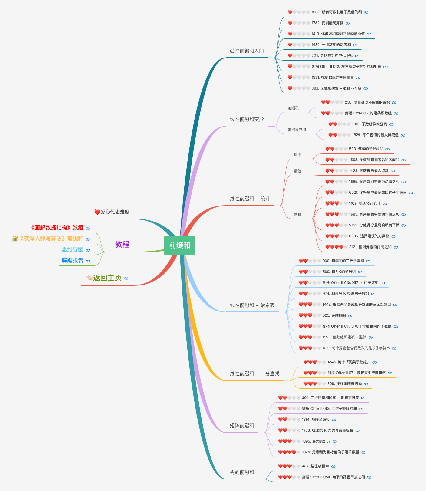

# 数据结构与算法

### 刷题记录

[线性表](https://docs.qq.com/mind/DQUluT1p3S0RXT2di?u=7997aeda3d244f6586ac8b50c5cf713f)

#### 最值算法，原地算法，高精度，二维数组	

[前缀和](https://docs.qq.com/mind/DQU5PYmlPaFFkVEdu?u=7997aeda3d244f6586ac8b50c5cf713f)

#### 6.14-线性前缀入门

#### 线性前缀和变形

